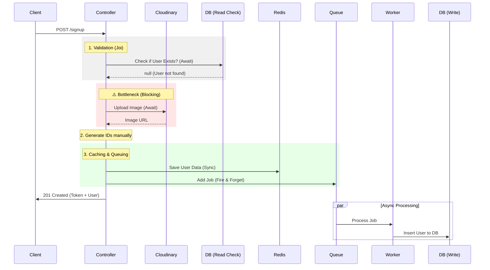

```mermaid
sequenceDiagram
    participant Client
    participant Controller
    participant Cloudinary
    participant DB_Read as DB (Read Check)
    participant Redis
    participant Queue
    participant Worker
    participant DB_Write as DB (Write)

    Client->>Controller: POST /signup

    rect rgb(240, 240, 240)
        Note over Controller: 1. Validation (Joi)
        Controller->>DB_Read: Check if User Exists? (Await)
        DB_Read-->>Controller: null (User not found)
    end

    rect rgb(255, 230, 230)
        Note over Controller, Cloudinary: ⚠️ Bottleneck (Blocking)
        Controller->>Cloudinary: Upload Image (Await)
        Cloudinary-->>Controller: Image URL
    end

    Note over Controller: 2. Generate IDs manually

    rect rgb(230, 255, 230)
        Note over Controller: 3. Caching & Queuing
        Controller->>Redis: Save User Data (Sync)
        Controller->>Queue: Add Job (Fire & Forget)
    end

    Controller->>Client: 201 Created (Token + User)

    par Async Processing
        Queue->>Worker: Process Job
        Worker->>DB_Write: Insert User to DB
    end
```
