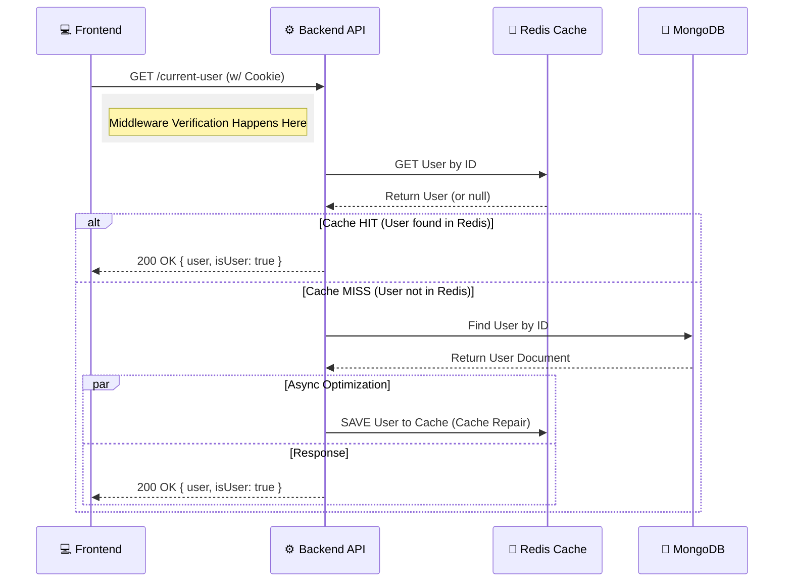

# 👤 Get Current User

**Endpoint:** GET /current-user**Access:** Protected (Requires Authentication)

### 📖 Overview

This endpoint is the "heartbeat" of the frontend authentication state. It checks if the requesting client has a valid session and returns the full profile of the currently logged-in user. It employs a **Read-Aside with Cache Repair** strategy to ensure high performance and reduce database load.

### 📥 Request Specification

- **URL:** /api/v1/auth/current-user (Adjust based on your actual prefix)
- **Method:** GET
- **Headers:**

  - Cookie: Must include a valid session cookie (handled automatically by the browser).

- **Body:** None

### 📤 Response Structure

The response returns a JSON object containing the authentication status and user data.

#### ✅ Success Response (200 OK)

JSON

Plain textANTLR4BashCC#CSSCoffeeScriptCMakeDartDjangoDockerEJSErlangGitGoGraphQLGroovyHTMLJavaJavaScriptJSONJSXKotlinLaTeXLessLuaMakefileMarkdownMATLABMarkupObjective-CPerlPHPPowerShell.propertiesProtocol BuffersPythonRRubySass (Sass)Sass (Scss)SchemeSQLShellSwiftSVGTSXTypeScriptWebAssemblyYAMLXML
```json
{    
  "token": "eyJhbGciOiJIUzI1NiIsIn...",  // The JWT String    
  "isUser": true,                        // Boolean flag indicating valid user    
  "user": {                              
    // Full User Document      
    "_id": "64b1f...",      
    "username": "Ahmed",      
    "email": "ahmed@example.com",      
    "avatarColor": "#f44336",      
    "profilePicture": "https://res.cloudinary...",      
    "notifications": { ... },      
    "social": { ... },      
    // ... other user profile fields   
    }  
} 
```

#### ❌ Error Responses

- **401 Unauthorized:** If the session cookie is missing or the JWT is invalid (handled by middleware before reaching this controller).

### 🔄 End-to-End Scenario (Frontend to Backend)

This scenario explains how the frontend should utilize this endpoint during the application lifecycle.

1.  **App Initialization (Mount):**

    - When the Frontend Application (React/Vue/Angular) loads for the first time (or on page refresh), it doesn't know if the user is logged in.
    - The Frontend makes a GET request to /current-user.

2.  **Cookie Transmission:**

    - The browser automatically attaches the httpOnly session cookie to the request.

3.  **Backend Processing:**

    - **Middleware:** Verifies the JWT signature and checks if the tokenVersion matches the database (security check).
    - **Controller:** Tries to fetch the user from **Redis Cache** first.
    - **Cache Miss (Optimization):** If not in Redis, it fetches from **MongoDB** and _immediately_ saves it back to Redis (Cache Repair) for future requests.

4.  **Frontend State Update:**

    - The Frontend receives the JSON response.
    - If isUser: true → Store the user object in the Global State (Redux/Context) and render the "Home Feed".
    - If error (401) → Redirect the user to the "Login Page".

### 🧠 Backend Logic Flow (Mermaid Diagram)

This diagram illustrates the **Cache-First** strategy with the **Cache Repair** mechanism implemented in this endpoint.


