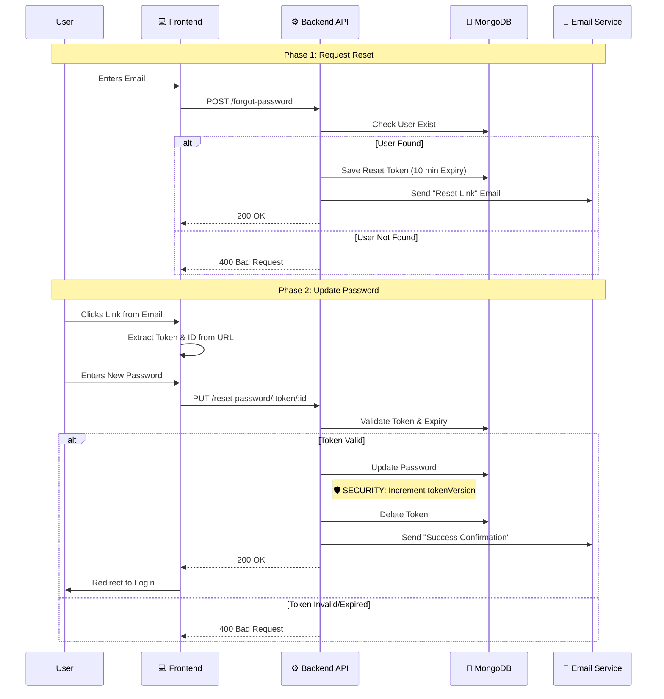

# 🔐 Password Management

**Module:** Auth / Security**Description:** Handles the secure process of resetting a forgotten password via email verification.

## 1️⃣ Request Password Reset (Forgot Password)

**Endpoint:** POST /forgot-password**Access:** Public

### 📖 Overview

This endpoint is the entry point when a user forgets their credentials. It validates the email existence and triggers a background job to send a secure, time-limited reset link to the user's inbox.

### 📥 Request Specification

- **URL:** /api/v1/forgot-password
- **Method:** POST
- **Body:**

```json
{
  "email": "user@example.com"
}
```

### 📤 Response Structure

#### ✅ Success Response (200 OK)

Note: For security reasons, the message should be generic even if the email doesn't exist (though the current implementation throws an error for non-existing users).

```json
{ "message": "Password reset email sent." }
```

#### ❌ Error Responses

- **400 Bad Request:** If the email format is invalid or the user does not exist.

## 2️⃣ Reset Password (Update)

**Endpoint:** PUT /reset-password/:token/:userId

**Access:** Public (Protected by Token Validation)

### 📖 Overview

This endpoint finalizes the process. It validates the secret token sent via email, updates the user's password, and **crucially performs a security lockout** (Logout All Devices) by incrementing the tokenVersion.

### 📥 Request Specification

- **URL:** /api/v1/reset-password/:token/:userId
- **Method:** PUT
- **URL Params:**

  - token: The hex string generated by the server.
  - userId: The specific user's MongoDB ID.

- **Body:**

```json
{
  "password": "NewStrongPassword123!",
  "confirmPassword": "NewStrongPassword123!" // (If required by schema)
}
```

### 📤 Response Structure

#### ✅ Success Response (200 OK)

```json
{ "message": "Password successfully updated." }
```

#### ❌ Error Responses

- **400 Bad Request:** If the token is invalid, expired, or the passwords do not match validation rules.

## 🔄 End-to-End Scenario (Frontend to Backend)

This flow describes the user journey from the "Login Page" back to a successful login with new credentials.

### Phase 1: Requesting the Link

1.  **User Action:** User clicks "Forgot Password?" on the login screen.
2.  **Frontend:** Displays an input form for the email address.
3.  **API Call:** Frontend sends POST /forgot-password with the email.
4.  **Backend:**

    - Verifies user existence.
    - Generates a random token (valid for 1 hour).
    - Sends an email containing a link: https://client-app.com/reset-password?token=XYZ&id=123.

5.  **User Action:** User checks their inbox and clicks the link.

### Phase 2: Updating the Password

1.  **Frontend Routing:** The App opens the /reset-password route. It extracts token and id from the URL Query Parameters.
2.  **User Action:** User enters the new password and clicks "Update".
3.  **API Call:** Frontend sends PUT /reset-password/XYZ/123 with the new password body.
4.  **Backend Action (Critical Security Steps):**

    - Validates the token from DB.
    - Updates the password (hashed).
    - **Increments tokenVersion** (Forces logout on all other devices/sessions).
    - Deletes the used token.
    - Sends a confirmation email to the user (security alert).

5.  **Frontend:** Redirects the user to the Login page to sign in with the new password.

## 🧠 Logic Flow (Mermaid Diagram)

This diagram visualizes the interaction between the User, Client, API, Database, and Email Service.


