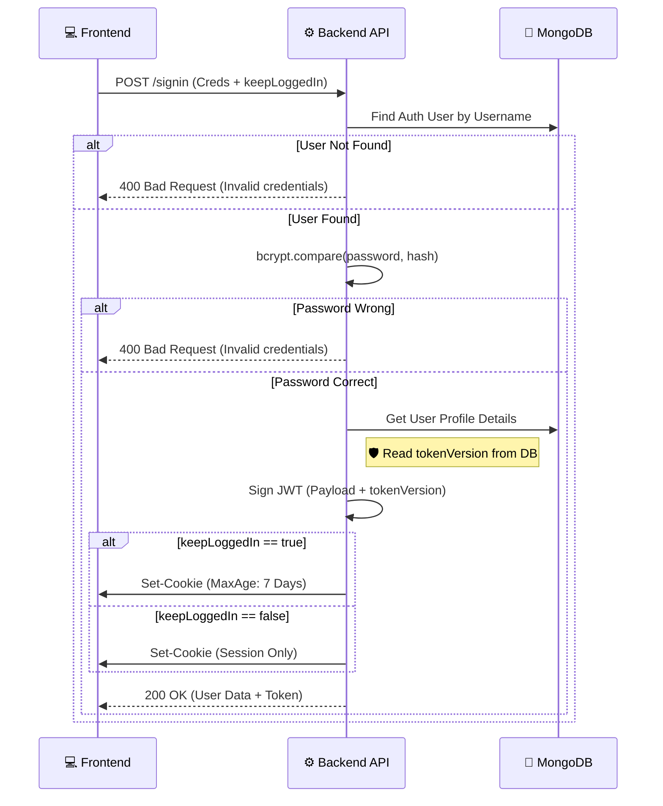

# 🔐 User Authentication (Signin)

**Module:** Auth**Description:** Authenticates a user using credentials, establishes a secure session via HTTP-only cookies, and retrieves the full user profile.

## 1️⃣ Login to Account

**Endpoint:** POST /signin**Access:** Public

### 📖 Overview

The login process is the gateway to the application. It performs strict security checks (Password Verification) and sets up the client's session.Key features implemented here:

1.  **Token Versioning:** Fetches the current tokenVersion from the database to ensure the issued JWT is valid against the latest security state (Logout All Devices strategy).
2.  **Persistent Sessions:** Handles the "Keep me logged in" logic by adjusting the cookie's expiration date.

### 📥 Request Specification

- **URL:** /api/v1/auth/signin
- **Method:** POST
- **Body:**

```json
{
  "username": "AhmedX",
  "password": "StrongPassword123!",
  "keepLoggedIn": true // Optional: boolean
}
```

### 📤 Response Structure

#### ✅ Success Response (200 OK)

Returns the full user profile and the signed JWT. The JWT is automatically set in the browser's cookie jar.

```json
  {    "message": "User login successfully",
  "user": {
    "_id": "64b2a...",
    "username": "AhmedX",
    "email": "ahmed@example.com",
    "avatarColor": "#ff0000",
    "profilePicture": "https://res.cloudinary...",
    "uId": "8273918273",
    "notifications": { ... },
    "social": { ... }
    // Note: 'password' and 'tokenVersion' are excluded from this object
    },
    "token": "eyJhbGciOiJIUzI1Ni..."
  }
```

#### ❌ Error Responses

- **400 Bad Request:** "Invalid credentials" (Generic error message used for both "User not found" and "Wrong password" to prevent User Enumeration attacks).

## 🔄 End-to-End Scenario (Frontend to Backend)

### Phase 1: User Entry

1.  **User Action:** User enters Username/Password on the login screen.
2.  **Option Selection:** User may check the **"Keep me logged in"** checkbox.
3.  **API Call:** Frontend sends POST /signin payload.

### Phase 2: Backend Verification

1.  **Auth Lookup:** Backend searches for the Auth document by Username.
2.  **Password Check:** Uses bcrypt.compare to verify the provided password against the hashed password.
3.  **User Lookup:** Fetches the detailed User profile document (needed for the UI).

### Phase 3: Token & Session Management 🛡️

1.  **JWT Generation:**

    - Retrieves the current tokenVersion from the DB.
    - Signs a new JWT containing: userId, email, uId, and **tokenVersion**.

2.  **Cookie Strategy (The "Remember Me" Logic):**

    - **If keepLoggedIn: true:** Sets maxAge to **7 Days** (Persistent Cookie).
    - **If keepLoggedIn: false:** Sets maxAge to undefined (Session Cookie - deleted when browser closes).

3.  **Response:** Sends 200 OK with the user data.

## 🧠 Logic Flow (Mermaid Diagram)

This diagram visualizes the decision-making process for Password Verification and Session configuration.


