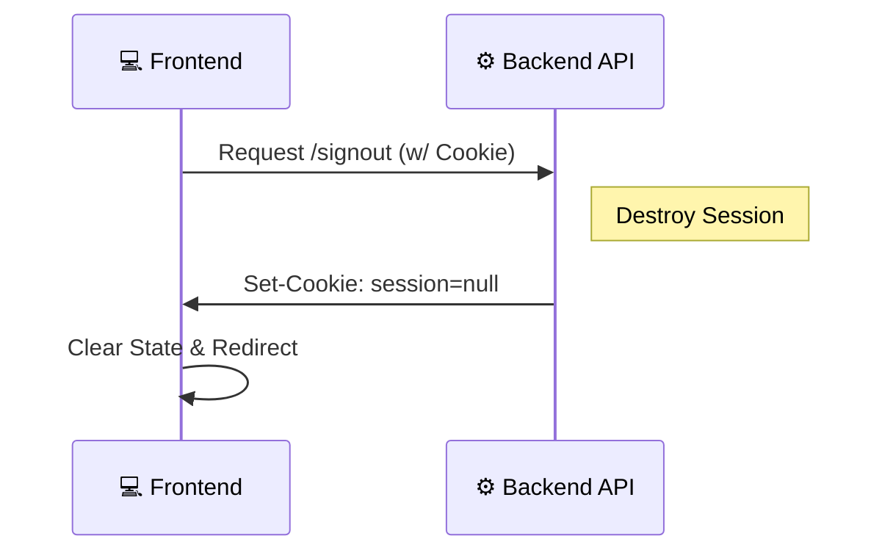

# 🚪 User Signout

**Module:** Auth**Description:** Securely terminates the user session by clearing the HTTP-only cookie.

## 1️⃣ Signout (Logout)

**Endpoint:** GET /signout (or POST)**Access:** Protected (Requires Authentication)

### 📖 Overview

This endpoint handles the user's request to log out. Since we use **Stateless JWTs** stored in **Cookies**, the primary action is to instruct the browser to discard the session cookie.

- **Note:** This is a "Client-Side" logout. For a "Security Logout" (e.g., hacked account), the tokenVersion strategy (implemented in Password Reset) is used instead.

### 📥 Request Specification

- **URL:** /api/v1/auth/signout
- **Method:** GET (can be POST depending on router config)
- **Headers:**

  - Cookie: Must include a valid session.

### 📤 Response Structure

#### ✅ Success Response (200 OK)

The response clears the token and user object from the client state.

```json
{
  "message": "Logout successfully",
  "user": {},
  "token": ""
}
```

## 🔄 End-to-End Scenario

1.  **User Action:** User clicks the "Logout" button in the Navbar.
2.  **API Call:** Frontend sends a request to /signout.
3.  **Backend Action:**

    - Sets req.session = null.
    - Sends a response header to the browser: Set-Cookie: session=; Max-Age=0.

4.  **Browser Action:** Immediately deletes the session cookie.
5.  **Frontend Action:** Clears the global state (Redux/Context) and redirects to the Login/Landing page.

## 🧠 Logic Flow (Mermaid Diagram)


