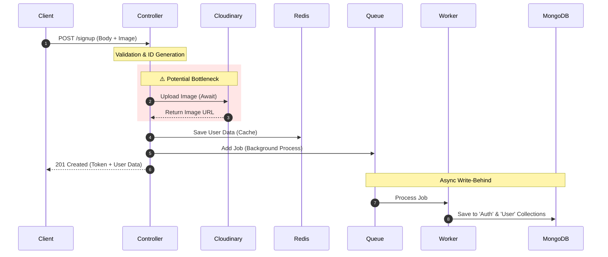

# 🚀 Feature: User Sign Up Documentation

## 1. System Workflow (Data Flow)

> This diagram illustrates the complete flow from the client request to the database write operation.

2. API Contract (Data Structure)
📥 Request Body (Client -> Server)
JSON

{
  "username": "Mena_Gerges",
  "password": "password123",
  "email": "mena@example.com",
  "avatarColor": "#f44336",
  "avatarImage": "data:image/png;base64,iVBORw0KGgoAAAANSUhEUgAA..."
}
📤 Response Data (Server -> Client)
JSON

{
  "message": "User created successfully",
  "token": "eyJhbGciOiJIUzI1NiIsInR5cCI6IkpXVCJ9...",
  "user": {
    "_id": "651234567890abcdef123456",
    "username": "Mena_Gerges",
    "email": "mena@example.com",
    "profilePicture": "[https://res.cloudinary.com/demo/image/upload/v1/user.jpg](https://res.cloudinary.com/demo/image/upload/v1/user.jpg)",
    "uId": "83402840211"
  }
}
3. Technical Implementation Notes 🛠️
🔒 Security & Hashing
Password Handling: Passwords remain in plain text throughout the Controller, Redis, and Queue layers.

Hashing Location: Hashing is strictly performed at the Data Access Layer using Mongoose pre('save') hook.

Implication: Developers must ensure Redis/Queue logs are secured as they contain raw passwords.

⚠️ Performance & Constraints
Cloudinary Upload: The current implementation performs a synchronous (await) upload to Cloudinary within the request lifecycle.

Risk: High concurrency (e.g., 100+ simultaneous signups) may cause Event Loop Blocking due to network I/O latency, leading to request timeouts.

Status: Acceptable for current traffic load.

Write-Behind Pattern: We return a success response before data is persisted to MongoDB.

Risk: Rare edge case where the Worker fails (e.g., duplicate key error) after the user has already received a success token.

🔮 Future Improvements
[ ] Move Cloudinary upload to the Client-side (React) to reduce server load.

[ ] Implement encryption for sensitive data inside Redis and BullMQ.

