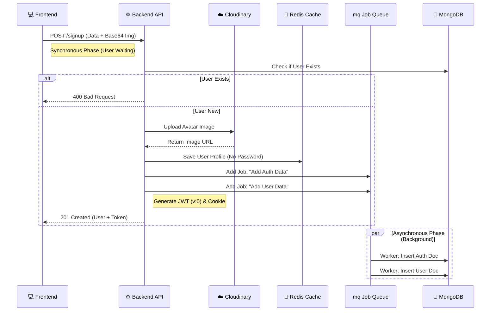

# 📝 User Registration (Signup)

**Module:** Auth**Description:** Handles new user creation, including profile image upload, caching, and background database synchronization.

## 1️⃣ Create New Account

**Endpoint:** POST /signup**Access:** Public

### 📖 Overview

This is a heavy-duty endpoint designed for high performance. Instead of writing directly to the database and making the user wait, it utilizes a **Cache-First & Queue-Based** architecture.

1.  Uploads avatar to **Cloudinary**.
2.  Saves user data immediately to **Redis Cache**.
3.  Offloads the database insertion to a **Job Queue** (Worker).
4.  Generates a **JWT** with tokenVersion: 0 for security.

### 📥 Request Specification

- **URL:** /api/v1/auth/signup
- **Method:** POST
- **Body:**

```json
{
  "username": "AhmedX",
  "password": "StrongPassword123!",
  "email": "ahmed@example.com",
  "avatarColor": "#ff0000",
  "avatarImage": "data:image/png;base64,iVBORw0KGgoAAAANSUhEUgAA..." // Base64 String
}
```

### 📤 Response Structure

#### ✅ Success Response (201 Created)

Returns the created user object (from cache) and the JWT. The JWT is also attached as an HttpOnly cookie.

```json
{
  "message": "User created successfully",
  "user": {
    "_id": "64b2a...",
    "username": "AhmedX",
    "email": "ahmed@example.com",
    "avatarColor": "#ff0000",
    "profilePicture": "https://res.cloudinary.com/...", // Cloudinary URL
    "uId": "8273918273",
    "postsCount": 0,
    // ... (Password is EXCLUDED from response & cache)
    "notifications": { ... },
    "social": { ... }
  },
  "token": "eyJhbGciOiJIUzI1Ni..."
}
```

#### ❌ Error Responses

- **400 Bad Request:** Validation errors (e.g., weak password), User already exists, or Image upload failure.

## 🔄 End-to-End Scenario (Frontend to Backend)

### Phase 1: User Interaction

1.  **User Action:** User fills the registration form and selects a profile picture.
2.  **Frontend Logic:**

    - Converts the image file to a **Base64** string.
    - Validates inputs locally (optional).

3.  **API Call:** Frontend sends POST /signup with the JSON payload.

### Phase 2: Backend Processing (The "Heavy Lifting")

1.  **Validation:** Backend checks schema (Joi) and verifies if username or email already exists in MongoDB.
2.  **Preparation:** Generates ObjectIDs and a random uId.
3.  **Cloudinary:** Uploads the Base64 image and retrieves the public URL.
4.  **Redis Cache (Speed Layer):**

    - Constructs the User Object (Clean: No Password).
    - Saves the user to Redis (userCache).

5.  **Job Queues (Async Layer):**

    - Adds a job to authQueue (to save credentials + tokenVersion: 0).
    - Adds a job to userQueue (to save profile details).

6.  **Security:** Signs a JWT containing tokenVersion: 0 and sets the Session Cookie.
7.  **Response:** Sends 201 Created to the client.

### Phase 3: Background Workers

1.  **Worker Process:** Pick up the jobs from the queue and insert the data into **MongoDB** asynchronously (User doesn't wait for this).

## 🧠 Logic Flow (Mermaid Diagram)

This diagram highlights the separation between Synchronous tasks (User waiting) and Asynchronous tasks (Background).



