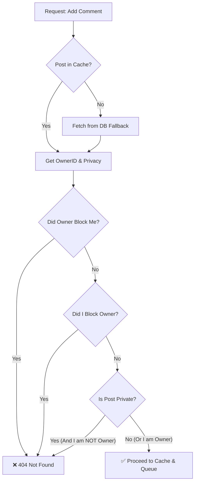

# 💬 Add Comment Feature Documentation

## 🎯 Overview

This feature allows users to add comments to posts. It follows a **Cache-First Strategy** to ensure extremely fast response times (< 50ms) while handling heavy logic (DB writes, Notifications) asynchronously via a **Message Queue**.

## 🔌 API Specification

**Method:** POST

**Endpoint:** /api/v1/post/comment

**Access:** Protected

**Description:** Adds a comment to a specific post.

### 📥 Request Body

```json
{
  "postId": "64b8f...", // Target Post ID (Required)
  "comment": "Great post! 🔥" // Comment Text (Required)
}
```

> **Note:** User details (username, avatar, id) are extracted securely from the **Auth Token**, not the request body.

## 🧠 Business Logic & Rules (Backend Internals)

### 1\. 🛡️ Blocking Rules

Before adding a comment, the system performs a strictly ordered check:

1.  **If Owner Blocked Me:** The API returns 404 Not Found. We act as if the post doesn't exist to protect the owner's privacy.
2.  **If I Blocked Owner:** The API returns 400 Bad Request ("You cannot comment on a post by a user you blocked").

### 2\. 🔐 Privacy Rules (Strict)

The system supports two privacy modes only:

- **Public:** Everyone can see and comment.
- **Private:** **Only the Post Owner** can see and comment.
  - _Logic:_ If privacy === 'private' AND currentUserId !== postOwnerId → Throw 404 Not Found.
  - _(Note: There is no "Followers Only" logic here. Private means strictly private)._

### 3\. 🏗️ Architecture (Cache-First)

1.  **Controller:** Fetches Post Owner ID from **Redis Cache** (fastest) to perform blocking/privacy checks.
2.  **Cache:** Comment is saved to Redis List comments:postId immediately.
3.  **Queue:** A job is sent to commentQueue.
4.  **Worker (Background):**
    - Saves comment to MongoDB.
    - Updates commentsCount in Post Document.
    - **Extracts userTo** (Post Owner) from the updated post.
    - Sends **Notification** (Socket + DB) to the post owner.

## 🎨 Frontend Integration Guide

### ✅ Scenario: User sends a comment

To ensure the best User Experience (UX), follow the **Optimistic UI** pattern:

1.  **User Input:** User types "Nice!" and hits Enter.
2.  **Immediate UI Update:**
    - Append the comment to the local list.
    - Increment the "Comments Counter" by +1.
    - Scroll to bottom (if needed).
    - _Do this BEFORE the API response._

3.  **API Call:** Send request to /api/v1/post/comment/add.
4.  **Handle Success (201):** Keep the UI as is.
5.  **Handle Error (400/404/500):**
    - **Rollback:** Remove the fake comment.
    - **Decrement:** The counter by -1.
    - **Alert:** Show a Toast Message ("Failed to add comment: \[Reason\]").

## 📊 Sequence Diagrams

### 1\. Logic Decision Tree (Validation Phase)

This happens inside the **Controller** before any data is saved.



### 2\. Data Flow (Architecture)

How the data moves from the user to the database.

```mermaid
sequenceDiagram
    autonumber
    actor User as 👤 User (Frontend)
    participant API as 🛡️ Controller
    participant Redis as ⚡ Redis Cache
    participant Queue as 📨 Queue (BullMQ)
    participant Worker as 👷 Worker
    participant DB as 💾 MongoDB
    participant Socket as 🔌 Socket.IO

    Note over User, API: 1. Optimistic UI Update happens here

    User->>API: POST /comment/add
    API->>Redis: Check Post Owner & Privacy 🕵️
    API->>Redis: LPUSH Comment & HINCRBY Count ⚡
    API->>Queue: Add Job 'addCommentToDB'
    API-->>User: 201 Created (Fast Response)

    rect rgb(42, 52, 60)
        Note right of Worker: Background Process
        Queue->>Worker: Process Job
        Worker->>DB: Save Comment Doc
        Worker->>DB: Update Post (Inc Count)
        Worker->>DB: Fetch Owner (userTo) from Post
        Worker->>DB: Create Notification
        Worker->>Socket: Emit 'insert notification' (to Owner) 🔔
    end
```


