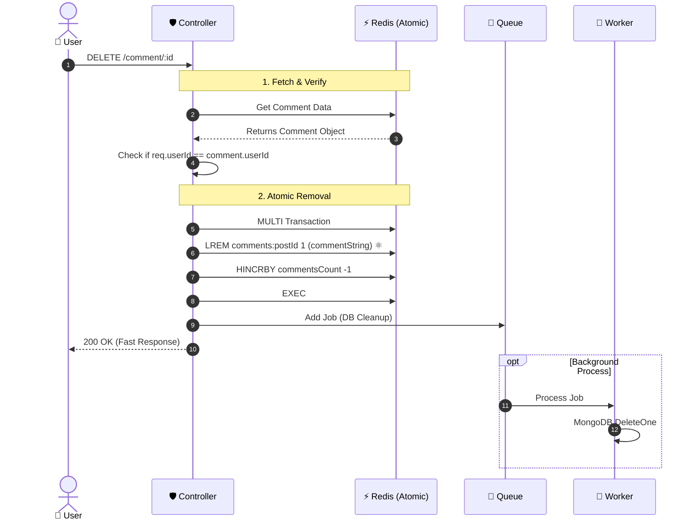

# 🗑️ Delete Comment Feature Documentation

## 🎯 Overview

This feature allows users to delete their **own** comments. It is designed to be **Atomic** and **Concurrency-Safe** using Redis LREM to prevent race conditions during high-traffic periods, ensuring that other users' new comments are never accidentally wiped out.

## 🔌 API Specification

**Method:** DELETE

**Endpoint:** /api/v1/post/comment/:postId/:commentId

**Access:** Protected

**Description:** Deletes a specific comment by ID.

## 🧠 Business Logic & Architecture

### 1\. 🛡️ Validation & Ownership

Before deletion, the system verifies:

- **Existence:** Attempts to fetch the comment from **Cache** first. If not found, falls back to **DB**.
- **Ownership:** Strictly checks if (comment.userId !== currentUserId).
  - _Security Note:_ Only the comment creator can delete it.

### 2\. ⚛️ Atomic Cache Deletion (LREM)

Instead of rewriting the whole list (which causes Race Conditions), we use Redis LREM:

- **Operation:** Removes _only_ the specific comment string that matches the one found.
- **Safety:** If another user adds a comment at the exact same millisecond, LREM leaves it untouched.
- **Counter:** Atomic decrement of commentsCount via HINCRBY -1.

### 3\. 📨 Asynchronous DB Cleanup

- The API returns 200 OK immediately after the Redis operation.
- A background job (deleteCommentFromDB) is sent to the Queue to remove the document from MongoDB and update counters eventually.

## 🎨 Frontend Integration Guide (Optimistic UI)

To ensure the app feels "Instant", use **Optimistic Updates**:

1.  **User Action:** User clicks "Delete" icon.
2.  **Immediate UI Update:**
    - **Remove** the comment 0DOM element immediately.
    - **Decrement** the comment counter by 1.

3.  **API Request:** Send DELETE request to server.
4.  **Handle Success:** Do nothing (UI is already updated).
5.  **Handle Error:**
    - **Rollback:** Add the comment back to the list.
    - **Increment:** Add 1 back to the counter.
    - **Toast:** Show "Failed to delete comment".

## 📊 Sequence & Logic Diagrams

###  The "Safe" Deletion Process (Why LREM?)

This diagram explains how we handle concurrency safely.

