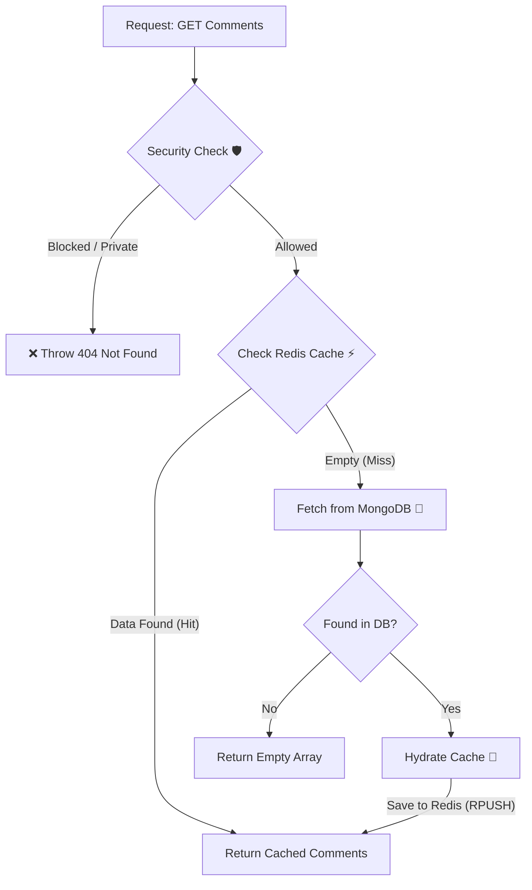
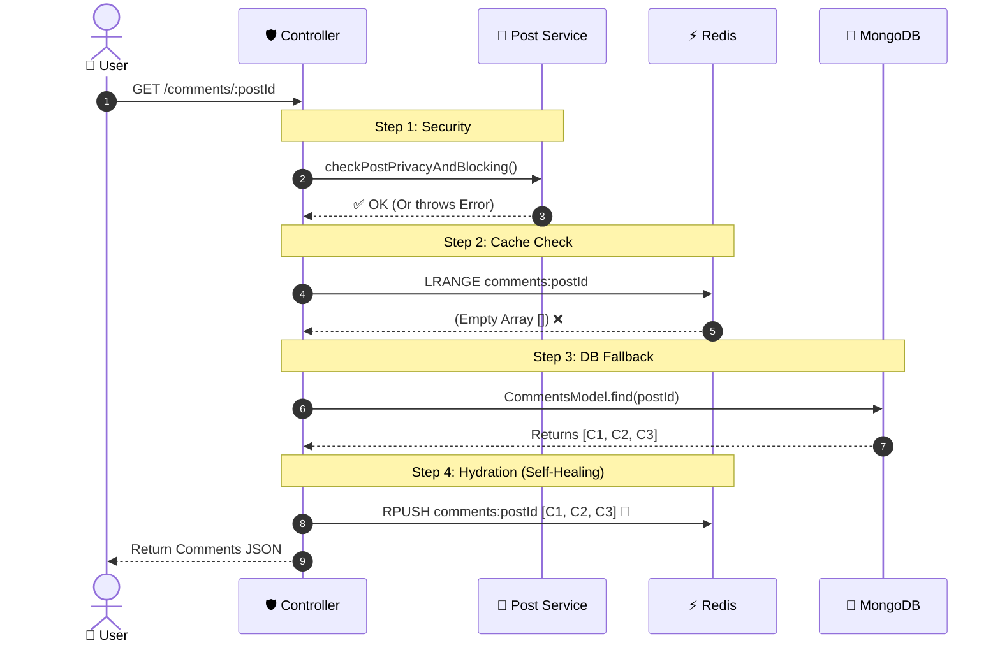

# 📖 Get Post Comments Documentation

## 🎯 Overview

This feature retrieves comments for a specific post. It is engineered for **High Performance** using a **Cache-First Strategy** with a **Self-Healing (Hydration)** mechanism. It also enforces strict **Security & Privacy** checks before returning any data.

## 🔌 API Specification

### 1\. Get All Comments

**Method:** GET

**Endpoint:** /api/v1/post/comments/:postId

**Access:** Protected

**Description:** Fetches all comments for a post (Newest First).

### 2\. Get Single Comment (Optional)

**Method:** GET

**Endpoint:** /api/v1/post/single/comment/:postId/:commentId

**Access:** Protected

**Description:** Fetches a specific comment by ID.

### 📤 Response Format (Success 200)

```json
{
  "message": "Post comments",
  "count": 15,
  "comments": [
    {
      "_id": "64b8f...",
      "username": "Ahmed",
      "comment": "This is amazing!",
      "createdAt": "2023-07-20T10:00:00.000Z",
      // ... other fields
    }
  ]
}
```

🧠 Business Logic & Architecture
--------------------------------

### 1\. 🛡️ Security Layer (The Gatekeeper)

Before fetching data, the system runs a unified check postService.checkPostPrivacyAndBlocking(postId, userId):

*   **Existence:** Checks if the post exists.

*   **Blocking:** Ensures the requester is not blocked by the owner AND hasn't blocked the owner.

*   **Privacy:** If the post is Private, ensures the requester is the **Owner**.

*   _Outcome:_ If any check fails -> Throw 404 Not Found (to hide existence).


### 2\. ⚡ Cache Strategy (Read-Through)

1.  **Hit:** Try to fetch comments from **Redis List** (comments:postId).

2.  **Miss:** If Redis is empty:

    *   Fetch from **MongoDB**.

    *   **Hydration Step:** Save the fetched comments back to **Redis** (using RPUSH to maintain order).

    *   _Benefit:_ The next request will hit the cache.


### 3\. 🐢 Database Optimization

*   Uses find() with sort({ createdAt: -1 }).

*   Avoids aggregate for simple fetching to reduce DB load.


📊 Visual Workflows (Mermaid)
-----------------------------

### 1\. Logic Flowchart (Decision Tree)

This diagram illustrates the decision process inside the Controller.



### 2\. Sequence Diagram (Hydration in Action)

Focuses on how the system "heals" itself when cache is empty.


👨‍💻 Frontend Implementation Notes

1.  **Error Handling:**
    
    *   If you receive 404 Not Found, it likely means the user is blocked or the post is private. Do not show "Error fetching comments", instead show "Post unavailable".
        
2.  **Display:**
    
    *   Render the list directly.
        
    *   If count === 0, show a "No comments yet" placeholder.
        
3.  **Single Comment (Deep Link):**
    
    *   If using the single-comment endpoint for notifications, use the returned comment ID to scroll and highlight the element in the UI.
