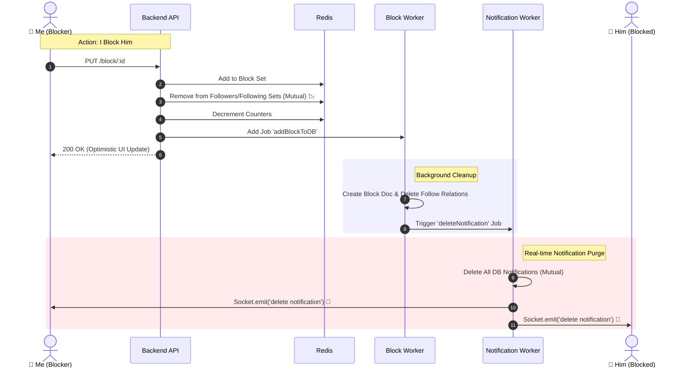

⛔ Block & Unblock System Documentation
======================================

🎯 Overview
-----------

This module handles the **Blocking** logic. Blocking is a "Destructive" operation that:

1.  Prevents two users from interacting.
    
2.  **Severing Ties:** Automatically triggers **Mutual Unfollow** (both users stop following each other).
    
3.  **History Cleanup:** Removes all past interactions (notifications) to ensure a "Ghosting" effect.
    

🔌 API Specification
--------------------

**Block User**

**Method:** PUT

**Endpoint:** /api/v1/user/block/:blockedUserId

**Params:** blockedUserId

**Description:** Blocks a user, unfollows mutual, cleans notifs.

**Unblock User**

**Method:** PUT

**Endpoint:** /api/v1/user/unblock/:blockedUserId

**Params:** blockedUserId

**Description:** Removes block. **Does NOT restore follow**.

**Get Blocked**

**Method:** GET

**Endpoint:** /api/v1/user/blocked

**Params:** page, limit

**Description:** Returns list of users blocked by me.

🎨 Frontend Integration Guide (Scenarios)
-----------------------------------------

### 1\. Blocking a User (The "Ghost" Protocol) 👻

**Scenario:** User A clicks "Block" on User B's profile.

#### ✅ Frontend Responsibilities:

1.  **Optimistic UI:**
    
    *   Immediately change button state to "Blocked" or "Unblock".
        
    *   **Hide Content:** Blur or hide User B's posts/profile data immediately.
        
    *   **Counters:** Decrement "Following" count by 1 (if User A was following B).
        
2.  **Navigation:**
    
    *   If blocked from the profile page, you might want to redirect User A to the home feed.
        

#### 📡 Real-time Socket Event (The Cleanup)

When User A blocks User B, the backend Worker triggers a cleanup event.

Both User A and User B (if online) will receive this event.

*   **Event Name:** delete notification
    
*   { "userFrom": "UserID\_Of\_The\_Other\_Person" }_(Note: When userFrom is sent without a specific notification ID, it implies_ _**Delete ALL**_ _notifications from this user)_.
    
*   **Frontend Action:**
    
    *   Listen for delete notification.
        
    *   Filter the Notifications List.
        
    *   **Remove ALL** items where userFrom.\_id === payload.userFrom.
        
    *   Update the unread badge count.
        

### 2\. Unblocking a User 🔓

**Scenario:** User A unblocks User B.

#### ⚠️ Crucial UX Note:

*   Unblocking returns the relationship to **"Strangers"**.
    
*   It does **NOT** automatically make them follow each other again.
    
*   **UI Update:** Change button from "Unblock" to **"Follow"** (Not "Following").
    

### 3\. Get Blocked Users (Pagination) 📜

*   **Endpoint:** /api/v1/user/blocked?page=1&limit=12
    
*   { "message": "Blocked users", "blockedUsers": \[ { "\_id": "...", "username": "...", "profilePicture": "...", "blockedBy": "..." } \]}
    
*   **Implementation:** Standard Infinite Scroll.
    

🏗️ Backend Architecture & Logic
--------------------------------

### 🧠 Block Logic (Why is it complex?)

We handle blocking in layers to ensure speed and consistency:

1.  **Redis (Immediate):**
    
    *   Add ID to users:blocked:userId Set.
        
    *   **Transactional Cleanup:** Removes IDs from following and followers sets for **both** users.
        
    *   Updates counters (followingCount, followersCount) in Cache.
        
2.  **Worker (Background - Persistence):**
    
    *   **DB:** Creates Block document.
        
    *   **DB:** Deletes Follower documents (Mutual).
        
    *   **Notification:** Triggers a job to delete all historical notifications between the two users.
        

### 🧠 Unblock Logic

*   **Redis:** Removes ID from users:blocked:userId.
    
*   **DB:** Deletes Block document.
    
*   _No relationship restoration happens here._
    

📊 Sequence Diagrams
--------------------

### 1\. Block User Flow (Full Cycle)

This diagram shows how we clean up the UI for both users using Sockets.



### 2\. Get Blocked Users (Smart Cache Strategy)

How we fetch the list efficiently.

```mermaid
graph TD
    A[Request Page 1] --> B{Check Redis Cache?}
    B -- Yes (Data Found) --> C[Get IDs from Set]
    C --> D[Hydrate User Data from UserCache]
    D --> E[Return Response ⚡]
    
    B -- No (Cache Miss) --> F[Fallback to MongoDB]
    F --> G[Aggregation Pipeline]
    G --> H[1. Match Blocker]
    G --> I[2. Sort & Pagination (Skip/Limit)]
    G --> J[3. Lookup User Details]
    J --> E
```
