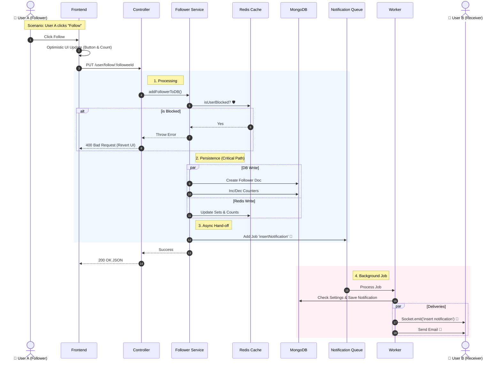

# 👥 Follower Feature: Add Follower Documentation

## 🎯 Overview

This feature allows a logged-in user to follow another user.

It is designed with a High-Performance Architecture that balances data consistency (DB/Redis) with fast response times (Async Notifications).

## 🔌 API Specification

**Route:** /api/v1/user/follow/:followeeId

**Method:** PUT

**Params:** followeeId: Target User ID✅

**Auth:** Required

**Description:** Executes the follow action.

### 📥 Request Details

- **Headers:** Authorization: Bearer
- **Params:**
  - followeeId: The \_id of the user you want to follow.

- **Body:** Empty (No body required).

### 📤 Response Examples

**✅ Success (200 OK)**

```json
{ "message": "Following user now" }
```

**❌ Error: Self Follow (400 Bad Request)**

```json
{ "message": "You cannot follow yourself." }
```

**❌ Error: Blocked (400 Bad Request)**

```json
{ "message": "Action denied." }
```

## 🎨 Frontend Integration Guide (User Scenarios)

### Scenario: User A follows User B

#### 1\. The Interaction (Optimistic UI) ⚡

To ensure the app feels "fast", the Frontend should implement **Optimistic UI updates**:

1.  **User Action:** User clicks the "Follow" button.
2.  **Immediate UI Update:**
    - Change button text to "Unfollow" (or "Following").
    - Increment the "Followers" count locally by +1.

3.  **API Call:** Send the PUT request in the background.
4.  **Error Handling:** If the API fails (e.g., Blocked), revert the UI changes (Change button back & Decrement count) and show a Toast Error.

#### 2\. Socket Events (Real-time Update) 📡

The **Receiver** (User B) needs to know they were followed without refreshing.

- **Event Name:** insert notification
- **Payload:** Contains userFrom (User A's details), message, and createdItemId.
- **Action:**
  - Show a Toast/Snackbar: _"User A is now following you."_
  - Update the Notification Badge count.

## 🏗️ Backend Architecture & Logic Flow

The system follows a **Clean Architecture** approach:

1.  **Controller Layer:**
    - Validates that userId !== followeeId.
    - Generates a new followerDocumentId (MongoDB ObjectId).
    - Delegates logic to the Service.
    - Returns response immediately.

2.  **Service Layer (The Core):**
    - **Validation:** Checks Redis Cache for Blocking (isUserBlockedBy).
    - **Persistence (Synchronous):**
      - Creates Follower document in MongoDB.
      - Updates followersCount & followingCount in User collection (Parallel).

    - **Caching (Synchronous):**
      - Updates Redis Sets (following:id, followers:id).
      - Updates Redis Hash Counters.

    - **Notification (Asynchronous):**
      - Adds a job to NotificationQueue (Fire-and-Forget).

3.  **Worker Layer (Background):**
    - Checks User B's notification settings.
    - Creates Notification in DB.
    - Emits Socket Event to User B's Room.
    - Sends Email (if enabled).

## 📊 Sequence Diagram (System Flow)

This diagram visualizes the journey of a "Follow" request from the button click to the notification delivery.


🛡️ Edge Cases & Safety Mechanisms
----------------------------------

1.  **Idempotency (Double Click):**
    
    *   If the user clicks "Follow" twice rapidly, the database unique index { followerId: 1, followeeId: 1 } prevents duplicate records. The backend silently ignores the second request (Code 11000 handled).
        
2.  **Self-Follow:**
    
    *   The Controller strictly checks if (currentUser.id === params.followeeId) and throws an error to prevent users from boosting their own stats.
        
3.  **Consistency:**
    
    *   We use Promise.all and synchronous DB waits in the Service to ensure that if the API returns "Success", the follow relationship **definitely exists** in the DB and Redis. No "Ghost Data".
