# 📜 Followers & Following Lists (Read Operations)

## 🎯 Overview

This module handles retrieving the lists of users who follow a specific user (Followers) and the users that a specific user follows (Following).

It is optimized for performance using a Cache-First Strategy with a smart Database Fallback mechanism to ensure data availability even if the cache is evicted.

## 🔌 API Specification

**Description**

**Get Following**

**Method:** GET

**Endpoint:** /api/v1/user/following/:userId

**Query :** page, limit

**Params:** Returns people the user follows.

**Get Followers**

**Method:** GET

**Endpoint:** /api/v1/user/followers/:userId

**Query :** page, limit

**Params:** Returns people following the user.

### 📥 Request Details

- **Path Param:** userId (The ID of the user whose list you want to view).
- **Query Params (Pagination):**
  - page: Page number (default: 1).
  - limit: Items per page (default: 12).

### 📤 Response Example (JSON)

✅ Success (200 OK)

The response structure is identical for both endpoints.

JSON

```json
{
  "message": "User following", // or "User followers"
  "totalFollowing": 150,       // The total count (for profile header/stats)
  "following": [               // The List (Array of Objects)
  {
    "_id": "65a1b2c3d4e5f6...",       // Follower Document ID
    "uId": "123456789",               // User Custom ID
    "username": "Ahmed_Ali",
    "avatarColor": "#a1b2c3",
    "profilePicture": "http://res.cloudinary.com/...",
    "postsCount": 10,
    "followersCount": 500,
    "followingCount": 20,
    "userProfile": { ... }            // Full User Object (optional)
    },
    // ... more users
  ]
  }
```

## 🎨 Frontend Integration Guide

### 1\. Infinite Scroll Implementation 📜

Since lists can be huge (thousands of users), we use **Pagination**.

- **Initial Load:** Call API with page=1.
- **On Scroll:** When the user reaches the bottom, increment page (page=2, page=3...).
- **Stop Condition:** Stop sending requests when:
  - The returned array length is less than limit.
  - OR current list length equals totalFollowing.

### 2\. Loading States (Skeleton UI) ⏳

- **First Load:** Show 12 Skeleton rows (Avatar + Name) while fetching page=1.
- **Load More:** Show a small spinner at the bottom while fetching next pages.

### 3\. Empty State 📭

- If totalFollowing === 0 OR following.length === 0:
  - Show a friendly message: _"This user isn't following anyone yet."_ or _"No followers yet."_

### 4\. Cache Consistency Note ⚠️

- The totalFollowing number comes from the **User Cache** (User Document).
- The following list comes from the **Follower Cache** (Redis Set) or MongoDB.
- **Edge Case:** In rare cases, the total number might differ slightly from the actual list length by 1 or 2 due to distributed system latency. The Frontend should trust the list for rendering and the total for showing the number badge.

## 🏗️ Backend Architecture & Fallback Logic

This logic is implemented in the **Controller** to ensure reliability.

1.  **Total Count Check:**
    - We first fetch the User object from Cache/DB to get the totalCount.
    - **Optimization:** If totalCount === 0, we return an empty array immediately (No DB/Redis call for list needed).

2.  **Primary Strategy (Redis Cache):**
    - We query Redis ZRANGE (Sorted Set) for the specific page range (e.g., 0-11).
    - If data exists, we hydrate user details from UserCache and return.

3.  **Smart Fallback (The Safety Net):**
    - **Condition:** If Redis returns an empty list \[\] **BUT** the totalCount > 0.
    - **Meaning:** This indicates the Cache was **Evicted** (cleared for memory).
    - **Action:** The Controller switches to **MongoDB Aggregation**.
    - **Result:** The user gets the data seamlessly from the DB without noticing the cache miss.

## 📊 Sequence Diagram (Read Flow)

This diagram visualizes the "Smart Fallback" decision process.

```mermaid
sequenceDiagram
    autonumber
    actor User as 👤 User/Frontend
    participant CTL as Controller
    participant UC as User Cache (Redis)
    participant FC as Follower Cache (Redis)
    participant DB as MongoDB (Aggregation)

    Note over User, CTL: User requests "Get Following" (Page 1)

    User->>CTL: GET /user/following/:id?page=1
    
    rect rgb(47, 57, 65)
        Note right of CTL: 1. Get Total Count (Guard)
        CTL->>UC: Get User Data
        UC-->>CTL: Returns User { followingCount: 50 }
    end

    alt Total Count is 0
        CTL-->>User: Return [] (Empty)
    else Total Count > 0
        rect rgb(66, 57, 40)
            Note right of CTL: 2. Try Cache Strategy
            CTL->>FC: ZREVRANGE following:id (0 to 11)
            FC-->>CTL: Result (IDs)
        end
        
        alt Cache Hit (IDs found)
            CTL->>UC: Fetch User Details for IDs
            CTL-->>User: Return Cached List ⚡
        else Cache Miss (Empty Array)
            Note right of CTL: 3. Smart Fallback (Evicted Cache)
            CTL->>DB: Aggregate (Match -> Skip -> Limit -> Lookup)
            DB-->>CTL: Return DB List 💾
            CTL-->>User: Return DB List
        end
    end
```


