# 💔 Follower Feature: Unfollow User Documentation

## 🎯 Overview

This feature allows a user to unfollow another user.

Unlike a simple "Delete" operation, this is a Cleanup Operation. It involves removing the database record, updating counters, cleaning Redis caches, and crucially, removing the old notification from the target user's list to maintain data consistency.

## 🔌 API Specification

**Route:** /api/v1/user/unfollow/:followeeId

**Method:** PUT

**Params:** followeeId: Target User ID✅

**Auth:** Required

**Description:** Executes the unfollow action.

### 📥 Request Details

- **Headers:** Authorization: Bearer
- **Params:**
  - followeeId: The \_id of the user you want to stop following.

- **Body:** Empty.

### 📤 Response Examples

**✅ Success (200 OK)**

```json
{ "message": "Unfollowed user now" }
```

**❌ Error (500 Server Error)**

```json
{ "message": "Server error. Try again." }
```

## 🎨 Frontend Integration Guide (Crucial Scenarios)

### Scenario A: User A (Me) clicks "Unfollow" on User B

#### 1\. Optimistic UI (Immediate Feedback) ⚡

Don't wait for the server! As soon as the button is clicked:

1.  **UI:** Change button text from "Following" to "Follow".
2.  **Stats:** Decrement the "Following" count by -1 immediately.
3.  **API:** Send the PUT request in the background.
4.  **Error Handling:** If the API fails, revert the changes (Increment count back & reset button).

### Scenario B: User B (The Receiver) is Online 🟢

This is the most critical part for UX.

Context: User B might have an unread notification saying "User A started following you". If User A unfollows, this notification becomes invalid (Ghost Notification).

#### 1\. Socket Event Listener 📡

The Frontend must listen for the delete notification event to clean up the notification list in real-time.

- **Event Name:** delete notification
- `{ "userTo": "UserB_ID", "userFrom": "UserA_ID", "notificationType": "follows"}`

#### 2\. Frontend Logic (What to do when event is received?)

When this event triggers, the Frontend should:

1.  **Scan:** Look through the current list of notifications in the State/Store.
2.  **Filter:** Find any notification where userFrom === payload.userFrom AND type === 'follows'.
3.  **Remove:** Delete it from the DOM immediately.
4.  **Badge:** Decrement the unread notifications badge count (if that specific notification was unread).

> Why do we do this?
>
> To prevent the user from clicking on a "New Follower" notification, only to be taken to a profile that is not actually following them anymore. It keeps the UI "Truthful".

## 🏗️ Backend Architecture & Logic Flow

The backend performs a "Cascading Cleanup":

1.  **Controller Layer:**
    - Extracts IDs.
    - Calls followerService.removeFollowerFromDB.
    - Returns 200 OK instantly.

2.  **Service Layer (Synchronous Cleanup):**
    - **DB:** Deletes the Follower document.
    - **DB:** Decrements followersCount and followingCount.
    - **Redis:** Removes IDs from followers and following Sets (ZREM).
    - **Redis:** Decrements cached counters.
    - **Queue:** Adds a deleteNotification job.

3.  **Worker Layer (Background Cleanup):**
    - **Smart Delete:** Searches for the notification by userFrom + userTo (since we don't have the Notification ID).
    - **Socket Emit:** Sends the delete notification event to the target user to clean their UI.

## 📊 Sequence Diagram (Unfollow Flow)

This diagram highlights the path from the Unfollow click to the removal of the specific notification on the other user's screen.

```mermaid
sequenceDiagram
    autonumber
    actor UserA as 👤 User A (Unfollower)
    participant FE as Frontend (User A)
    participant API as API/Controller
    participant SVC as Service
    participant DB as MongoDB & Redis
    participant Q as Notification Queue
    participant WRK as Worker
    participant FE_B as Frontend (User B)

    Note over UserA, FE: Scenario: User A clicks "Unfollow"

    UserA->>FE: Click Unfollow
    FE->>FE: Optimistic UI (Button & Count -1)
    FE->>API: PUT /user/unfollow/:id

    API->>SVC: removeFollowerFromDB()

    rect rgb(147, 106, 106)
        Note right of SVC: 1. Hard Delete
        SVC->>DB: Delete Follower Document
        SVC->>DB: Decrement Counters (DB & Redis)
        SVC->>DB: Remove from Redis Sets
    end

    Note right of SVC: 2. Cleanup Trigger
    SVC->>Q: Add Job 'deleteNotification' 🧹

    SVC-->>API: Success
    API-->>FE: 200 OK JSON

    rect rgb(33, 54, 33)
        Note right of Q: 3. Background Cleanup
        Q->>WRK: Process Job
        WRK->>DB: Find & Delete "Follow" Notification

        Note right of WRK: 4. Real-time UX Fix
        WRK->>FE_B: Socket.emit('delete notification') 📡
        FE_B->>FE_B: Remove Notification from List
    end
```


