📸 Add Image Feature: Architectural Overview
============================================

🚀 Business Value & Core Logic
------------------------------

This feature is not just a file uploader; it is a **Real-time Synchronization System** designed to manage user media efficiently.Instead of simply saving a URL, the controller orchestrates a complex flow between **Cloudinary, Redis, Socket.io, and MongoDB** to ensure high performance and data consistency.

### Key Architectural Decisions

#### 1\. The "Centralized Gallery" Strategy (The Photos Tab) 🖼️

*   **The Problem:** In a social app, users often want to see a "Photos" tab containing all images they've ever posted (Profile, Background, or Posts). Querying the PostCollection or UserCollection to filter and find these images is extremely slow (Heavy Read Operation).
    
*   **Our Solution:** We introduced a dedicated ImageCollection in MongoDB.
    
*   **The Benefit:** Every time an image is uploaded, it is logged in this central collection. When the Frontend needs to render the "Photos Tab", it queries this lightweight collection directly.
    
    *   **Result:** Lightning-fast retrieval of user media history without scanning thousands of posts.
        

#### 2\. Unique IDs & History Preservation 🕰️

*   **Logic:** We deliberately **do not overwrite** old images in Cloudinary or the Database.
    
*   **Benefit:** This automatically builds a "History" of profile pictures. Users can revert to an old profile picture instantly without re-uploading it.
    

#### 3\. "Fail-Safe" Cache Architecture 🛡️

*   **Logic:** The controller prioritizes Redis for speed but includes a **Self-Healing Mechanism**.
    
*   **Benefit:** If Redis is down or the cache is evicted (cleared), the system doesn't crash. It seamlessly fetches data from MongoDB, serves the request, and **repairs the cache** (populates Redis again) in the background.
    

🔄 End-to-End Data Flow (Scenario)
----------------------------------

The following diagram illustrates the journey of a request from the Frontend to the Database.

```mermaid
sequenceDiagram
    autonumber
    actor User
    participant FE as Frontend (React)
    participant API as Backend API
    participant Cloud as Cloudinary
    participant Redis as Redis Cache
    participant Socket as Socket.io
    participant Q as Worker Queue
    participant DB as MongoDB

    Note over User, FE: Scenario: User changes Profile Picture

    User->>FE: Selects Image
    FE->>API: POST /images/profile (Base64 or Existing ID)
    
    rect rgb(90, 117, 141)
        Note right of API: 1. Processing
        alt New Image
            API->>Cloud: Upload & Generate Unique ID
        else Existing Image (Gallery)
            API->>API: Reuse ID & Version
        end
    end

    rect rgb(177, 124, 142)
        Note right of API: 2. Caching & Repair
        API->>Redis: Update User Data
        opt Cache Miss (User not in Redis)
            API->>DB: Fetch User
            API->>Redis: REPAIR: Save User to Set & Hash
        end
    end

    rect rgb(96, 118, 96)
        Note right of API: 3. Real-time Sync
        API->>Socket: Emit 'update user' (Full Object)
        Socket-->>FE: Update Global State (Redux/Context)
    end

    rect rgb(72, 72, 59)
        Note right of API: 4. Persistence
        API->>Q: Add Job 'addUserProfileImageToDB'
        API-->>FE: 200 OK (Response)
    end
    
    Note over Q, DB: Background Process
    Q->>DB: Update User Document
    Q->>DB: Insert into 'ImageCollection' (For Gallery)
```

⚡ Handling Edge Cases
---------------------

We have engineered the controller to handle specific failure scenarios robustly:

**Huge File UploadFail-Fast Validation:** A custom Joi validator checks the Base64 string length before processing. If > 5MB, it rejects the request immediately to save server RAM/Bandwidth.

**Cache EvictionSmart Fallback:** If the user is missing from Redis, the controller fetches from DB, serves the response, and performs a full 

**Cache Repair** (HSET + ZADD) to ensure consistency for future requests.

**Network LagOptimistic UI (via Socket):** The Frontend receives the Socket event almost instantly, updating the UI before the Database write is even confirmed.

**Cloudinary FailureAtomic Stop:** If the upload fails, the process aborts immediately. No DB entries or Cache updates occur, preventing "Ghost Images" (records without actual files).Export to Sheets

🔌 Socket.io Usage Scenarios
----------------------------

Why do we use Sockets here instead of just waiting for the HTTP response?

1.  **Multi-Device Synchronization (The "Magic" Factor):**
    
    *   _Scenario:_ User is logged in on both **Desktop** and **Mobile**.
        
    *   _Action:_ User changes profile picture on Mobile.
        
    *   _Socket Effect:_ The Desktop session receives the update user event and instantly updates the header/sidebar image without the user refreshing the page.
        
2.  **State Consistency:**
    
    *   Instead of sending just the image URL, we broadcast the **Full User Object**. This ensures that the Frontend's global state (Redux) is entirely completely in sync with the Backend, preventing partial data glitches.
        

🛠️ Frontend Integration Guide
------------------------------

To utilize this controller effectively, the Frontend should handle two distinct scenarios:

### Scenario A: New Upload (Device Camera/File)

When the user picks a fresh file:

1.  Convert file to **Base64**.
    
2.  Send payload: { "image": "data:image/..." }.
    
3.  _Backend Behavior:_ Uploads to Cloudinary -> Generates **New** Public ID.
    

### Scenario B: Reuse from Gallery (Photos Tab)

When the user selects an old photo from their history:

1.  Extract publicId and version from the clicked image.
    
2.  Send payload: { "existingPublicId": "xyz", "existingVersion": "123" }.
    
3.  _Backend Behavior:_ Skips Cloudinary upload -> Reconstructs URL -> Updates Profile to point to this **Existing** image.
