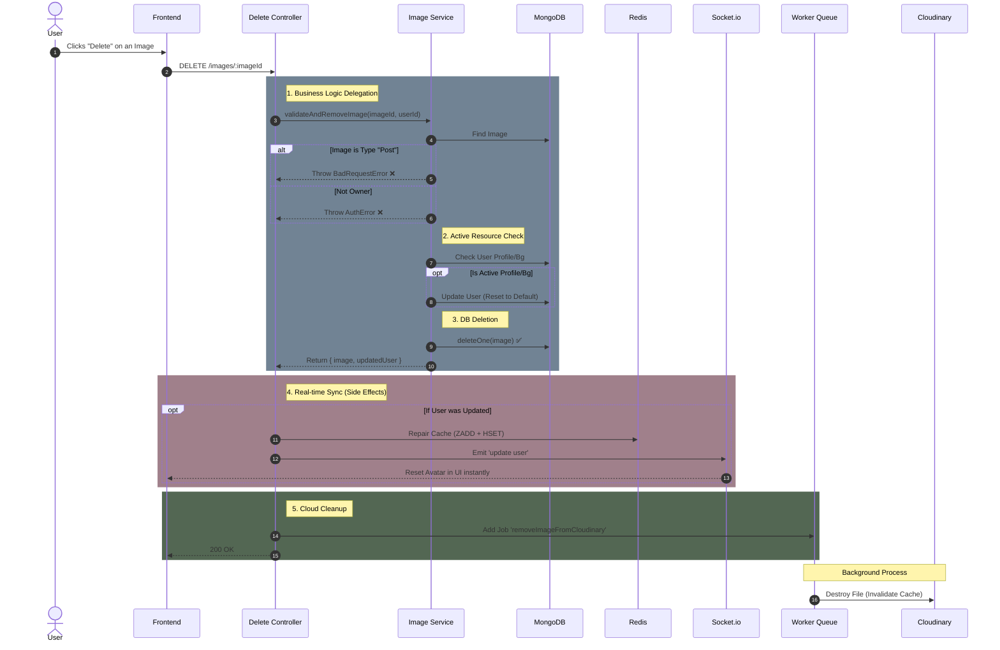

🗑️ Delete Image Feature: Architectural Documentation
=====================================================

🎯 Overview
-----------

The **Delete Image Feature** allows users to manage their media history (Gallery) by permanently removing specific images.This is not a simple database deletion; it is a **Smart Cleanup Operation** that ensures data consistency across MongoDB, Redis, and Cloudinary, while protecting the integrity of other features (like Posts).

⛔ Business Logic & Constraints
------------------------------

This controller implements strict rules to prevent data corruption:

### 1\. The "Post Integrity" Rule 🛡️

*   **Rule:** Images associated with a **Post** (type: 'post') **CANNOT** be deleted via this endpoint.
    
*   **Why:** A post owns its image. If we delete the image here, the post remains in the Feed but becomes "broken" (blank content).
    
*   **Solution:** Users must delete the Post itself via the **Post Feature**. The Post Service will then handle the image cleanup internally.
    

### 2\. The "Active Resource" Handling 🔄

*   **Rule:** If a user deletes an image that is currently set as their **Profile Picture** or **Background Image**:
    
    1.  The system detects this relationship.
        
    2.  It automatically **Resets** the user's profile/background to the default state in the Database.
        
    3.  It updates Redis and triggers a Socket event to reflect the reset instantly on the UI.
        

### 3\. Ownership Verification 👮‍♂️

*   **Rule:** A user can only delete images they uploaded. Attempting to delete another user's image results in a Not Authorized error.
    

🔄 End-to-End Scenario (Frontend to Backend)
--------------------------------------------

### The User Story

> "As a user, I open my 'Photos' tab. I see an old profile picture I no longer like. I click the trash icon to delete it."

### Step-by-Step Execution Flow

1.  **Frontend (Action):**
    
    *   User clicks **Delete**.
        
    *   App sends DELETE /api/v1/images/64b5f... (Image ID) with the Auth Token.
        
2.  **Backend (Controller Layer):**
    
    *   Receives the request.
        
    *   Delegates the entire logic to the ImageService.
        
3.  **Backend (Service Layer - The Brain):**
    
    *   **Fetch:** Finds the image in MongoDB.
        
    *   **Guard:** Checks if (type === 'post') -> Throws Error if true.
        
    *   **Guard:** Checks if (userId !== currentUserId) -> Throws Error if true.
        
    *   **Logic:** Checks if this image publicId matches the current user.profilePicture.
        
        *   _If Match:_ Updates User DB to default -> Returns the updated User object.
            
    *   **Delete:** Executes await ImageModel.deleteOne() (Fast DB operation).
        
4.  **Backend (Controller Side-Effects):**
    
    *   **If User Updated:**
        
        *   Updates Redis Cache (saveUserToCache).
            
        *   Emits Socket Event (update user) -> **Frontend updates Navbar/Header instantly**.
            
    *   **Cleanup:** Adds a job to **Image Queue** (removeImageFromCloudinary).
        
5.  **Background Worker (The Janitor):**
    
    *   Picks up the job asynchronously.
        
    *   Calls Cloudinary API to permanently destroy the file.
        
6.  **Frontend (Completion):**
    
    *   Receives 200 OK.
        
    *   Removes the image from the local Gallery list.
        

📊 Sequence Diagram
-------------------

🏗️ Architectural Decisions
---------------------------

### 1\. Thin Controller, Fat Service Pattern

*   **Controller:** Does not know _how_ to delete or validate. It simply orchestrates the infrastructure (Socket, Queue, HTTP Response).
    
*   **Service:** Contains all the if/else logic, database queries, and rules. This makes the logic reusable and easy to test.
    

### 2\. Queue for Cloudinary vs. Await for MongoDB

*   **MongoDB Deletion:** Kept as await in the main thread because deleting a document by ID takes **<10ms**. It ensures Strong Consistency (User sees it gone immediately).
    
*   **Cloudinary Deletion:** Moved to **Queue** because external API calls are unpredictable (can take 500ms - 2s). We don't want the user to wait for this.
    

### 3\. Smart Cache Repair

*   When the Active Profile Picture is deleted, we don't just update the DB. We perform a full **Cache Repair** (HSET + ZADD) to ensure Redis acts as a reliable Source of Truth for subsequent requests.
    

🔌 API Specification
--------------------

**Route**: /api/v1/images/:imageId

**Method**: DELETE

**Params**: imageId (MongoDB \_id)

**Description**: Permanently deletes an image from the user's gallery.Export to Sheets

**Responses:**

*   200 OK: Image deleted successfully.
    
*   400 Bad Request: Attempting to delete a **Post** image.
    
*   401 Not Authorized: Attempting to delete someone else's image.
    
*   404 Not Found: Image ID does not exist.
