🖼️ Get Images & Gallery Feature: Architectural Overview
========================================================

🎯 Strategic Approach
---------------------

Instead of creating multiple endpoints (e.g., getPostImages, getProfileImages), we implemented a Single Generic Endpoint.

This "Master Route" gives the Frontend complete flexibility to request any combination of images by simply changing parameters.

**Key Benefits:**

1.  **DRY Principle:** Single service logic handles all filtering and pagination.
    
2.  **Scalability:** If we add a new image type (e.g., story) in the future, no backend changes are needed; the frontend just requests it.
    
3.  **Performance:** Uses Promise.all to fetch data and total count concurrently.
    

🎨 Frontend Use Cases (UI Scenarios)
------------------------------------

This controller supports three distinct UI behaviors. **Do not forget these during Frontend implementation:**

### 1\. The "All Media" Tab (Default Gallery) 📂

*   **User Action:** User opens the "Photos" tab on a profile and selects "All".
    
*   **Goal:** Show a mix of everything (Profile pics, Backgrounds, and Post images) sorted by newest.
    
*   **API Call:** GET /images/:userId/1 (No type specified).
    

### 2\. The "Photos" Tab (Clean Feed) 📸

*   **User Action:** User filters by "Photos" (expecting only actual content/posts).
    
*   **Goal:** Hide system images (like profile updates) and show only images uploaded within posts.
    
*   **API Call:** GET /images/:userId/1/post
    

### 3\. The "History Picker" (Edit Profile Mode) ♻️

*   **User Action:** User clicks "Change Profile Picture" -> "Select from Previous".
    
*   **Goal:** The user wants to revert to an old profile picture. We must **only** show previous profile images (filtering out posts and backgrounds).
    
*   **API Call:** GET /images/:userId/1/profile
    
    *   _(Similarly for Backgrounds: .../1/background)_
        

🏗️ Backend Logic & Performance
-------------------------------

### 1\. Dynamic Query Building

The Service layer constructs the MongoDB query dynamically based on the presence of the type parameter.

TypeScript

```
// Logic Concept  
const query = { userId };  
if (type) query.type = type; // Adds filter only if requested   
```

### 2\. Parallel Execution (Optimization) ⚡

We need to return two things:

1.  The **Images** (for the current page).
    
2.  The **Total Count** (so the Frontend knows if it should stop scrolling).
    

Instead of waiting for one to finish before starting the other, we use Promise.all:

*   **Query 1 (Find):** skip(offset).limit(12).sort(-createdAt)
    
*   **Query 2 (Count):** countDocuments(query)
    
*   **Result:** Both execute in parallel, reducing response time by ~40%.
    

### 3\. Caching Strategy 🛑

**Decision:** We do **NOT** cache this endpoint in Redis.

*   **Reason:** Gallery lists change frequently (uploads/deletes) and have infinite permutations (Page 1 + Filter A, Page 2 + Filter B). Caching pagination creates complex invalidation nightmares.
    
*   **Alternative:** MongoDB is highly optimized for this via the userId index.
    

🔌 API Specification
--------------------

**Route:** /api/v1/images/:userId/:page/:type?

**Method:** GET

**Params:** userId: Target User , page: Page Number (1, 2...) , type (Optional):

**Description:** Filter Fetches a paginated list of images.

**Response Format:**

```json
{    
  "message": "User images",    
  "images": [ ... ],  // Array of 12 images    
  "total": 53       // Total count for this filter  
}
```

📊 Sequence Diagram (Flow)
--------------------------

This diagram illustrates how the "Infinite Scroll" works from Frontend to Database.

```mermaid
sequenceDiagram
    autonumber
    actor User
    participant FE as Frontend (React)
    participant CTL as Get Image Controller
    participant SVC as Image Service
    participant DB as MongoDB

    Note over User, FE: Scenario: User scrolls down in "Photos" Tab

    User->>FE: Reaches bottom of Page 1
    FE->>CTL: GET /images/12345/2/post
    
    rect rgb(63, 79, 93)
        Note right of CTL: 1. Processing
        CTL->>SVC: getImages(userId, page=2, type='post')
        SVC->>SVC: Calculate Skip: (2-1) * 12 = 12
        SVC->>SVC: Build Query: { userId: '...', type: 'post' }
    end

    rect rgb(80, 70, 73)
        Note right of SVC: 2. Parallel DB Execution
        par Fetch Images
            SVC->>DB: find(query).sort(-1).skip(12).limit(12)
        and Count Total
            SVC->>DB: countDocuments(query)
        end
        DB-->>SVC: Returns [Images] & Total Count
    end

    SVC-->>CTL: Returns Data
    CTL-->>FE: 200 OK JSON
    
    Note over FE: Frontend appends new images to the list
```


✅ Implementation Checklist
--------------------------

*   \[ \] **Infinite Scroll:** Frontend must implement an "Intersection Observer" to trigger the next page load when the user scrolls down.
    
*   \[ \] **Empty States:** Frontend should handle cases where images.length === 0 (e.g., "No photos found").
    
*   \[ \] **Type Handling:** Ensure the Frontend sends the correct strings (post, profile, background) matching the Backend Enum.
