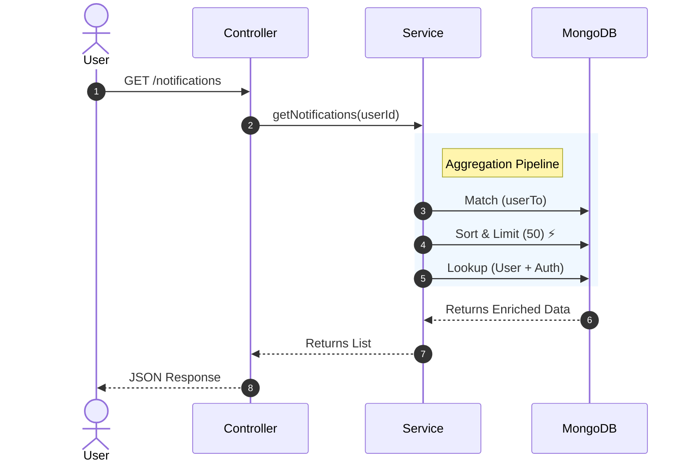
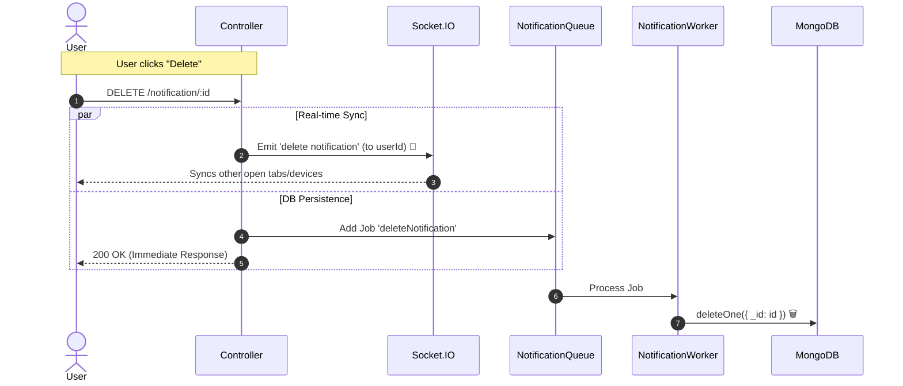

# 🔔 Notification System Documentation

## 🎯 Overview

The Notification module manages the user's interaction history (Likes, Comments, Follows). It is designed for **High Read/Write Throughput** using a **Queue-based Architecture** for database writes and **Socket.IO** for real-time multi-device synchronization.

## 🔌 API Specification

**Get List**

**Method:** GET

**Endpoint:** /api/v1/notifications

**Params:** None

**Description:** Fetches user's notifications with sender details.

**Mark Read**

**Method:** PUT

**Endpoint:** /api/v1/notification/:notificationId

**Params:** notificationId

**Description:** Marks a specific notification as read.

**Delete**

**Method:** DELETE

**Endpoint:** /api/v1/notification/:notificationId

**Params:** notificationId

**Description:** Permanently deletes a notification.

## 🎨 Frontend Integration Guide

### 1\. Fetching Notifications (Initial Load) 📥

- Call GET /api/v1/notifications.
- **State Management:** Store the list in Redux/Context notifications array.
- **Badges:** Calculate the "Unread Count" based on read: false items.

### 2\. User Actions (Optimistic UI) ⚡

When a user clicks "Mark as Read" or "Delete":

1.  **Immediate UI Update:** Update the Redux state locally **before** the API response (Optimistic UI).
2.  **API Call:** Send the request to the backend.
3.  **Error Handling:** Revert state if the API fails (rare).

### 3\. Multi-Device Synchronization (Socket.IO) 🔄

This is crucial. If the user deletes a notification on their **Phone**, it should vanish from their **Laptop** instantly without a refresh.

- **Listen for Event:** update notification (for read status) and delete notification.
- Payload Logic:

```
// Frontend Socket Listenersocket.on('delete notification', (notificationId) => { // Filter out this ID from the current Redux state dispatch(removeNotification(notificationId));});
```

## 🏗️ Backend Architecture

### 1\. The Service (Smart Aggregation)

- **Method:** getNotifications
- **Optimization:** We apply $sort and $limit: 50 **before** performing expensive $lookup operations (Joins). This ensures we only hydrate the necessary data.
- **Reuse:** Uses a shared aggregation pipeline helper to avoid code duplication.

### 2\. The Controller (Sync & Async)

- **Sync:** Emits Socket.IO events immediately to userTo (Current User) to sync their other active devices.
- **Async:** Offloads the Database write operation (updateOne / deleteOne) to the notificationQueue.
- **Validation:** Uses Joi to validate notificationId before processing.

## 📊 Sequence Diagrams

### 1\. Get Notifications Flow

How we efficiently retrieve complex data.



### 2\. Delete/Update Flow (Queue + Socket)

How we handle actions while ensuring performance and sync.


