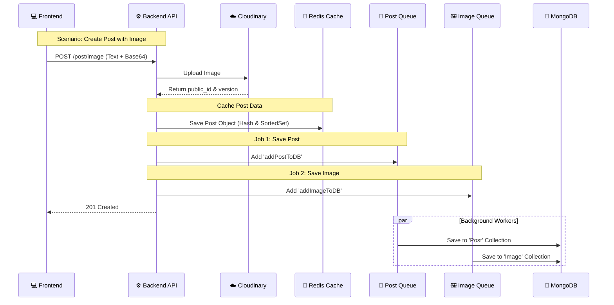

# 📝 Create Post Feature

**Module:** Post**Description:** Handles the creation of new posts with text, images, or videos using a high-performance **Cache-First** architecture.

## 1️⃣ Create Text Post

**Endpoint:** POST /post**Access:** Protected (Requires Authentication)

### 📖 Overview

Creates a standard text/background-colored post.

- **Performance Strategy:** The post is saved immediately to **Redis** (Hash & Sorted Set) and broadcasted via **Socket.IO** for real-time feed updates. Database insertion is offloaded to a **Job Queue**.

### 📥 Request Specification

- **URL:** /api/v1/post
- **Method:** POST
- **Body:**

```json
{
  "post": "This is my new status!",
  "bgColor": "#ffffff", // Optional
  "privacy": "Public", // Public, Private, Followers
  "gifUrl": "",
  "profilePicture": "http://res.cloudinary...",
  "feelings": "happy"
}
```

## 2️⃣ Create Post with Image

**Endpoint:** POST /post/image**Access:** Protected

### 📖 Overview

Handles post creation with an attached image.

- **Upload Logic:** Currently accepts a **Base64** string, uploads it to **Cloudinary**, and then proceeds with the standard caching and queuing flow.
- **Note:** Supports imageQueue to handle image optimization or storage references in the background.

### 📥 Request Specification

- **URL:** /api/v1/post/image
- **Method:** POST
- **Body:**

```json
{
  "post": "Look at this view!",
  "image": "data:image/jpeg;base64,/9j/4AAQSkZJRg...", // Base64 String
  "privacy": "Public"
  // ... other fields
}
```

## 3️⃣ Create Post with Video

**Endpoint:** POST /post/video**Access:** Protected

### 📖 Overview

Handles post creation with an attached video file.

- **⚠️ Performance Note:** Uses Base64 upload logic. For large files (>10MB), this may cause timeouts. Future refactoring will implement **Direct Client-to-Cloud Upload**.

### 📥 Request Specification

- **URL:** /api/v1/post/video
- **Method:** POST
- **Body:**

```json
{
  "post": "Check out my vlog!",
  "video": "data:video/mp4;base64,AAAA...", // Base64 String
  "privacy": "Public"
  // ... other fields
}
```

## 📤 Response Structure (Common for All)

#### ✅ Success Response (201 Created)

Returns the fully constructed Post Object (including IDs generated by the server).

```json
{
  "message": "Post created successfully",
  "post": {
    "_id": "64b5f...",
    "userId": "64b1a...",
    "username": "Ahmed",
    "post": "This is my new status!",
    "imgId": "v12345/posts/image_id",
    "imgVersion": "168...",
    "reactions": { "like": 0, "love": 0, ... },
    "commentsCount": 0,
    "createdAt": "2023-07-20T10:00:00.000Z"
    }
}
```

#### ❌ Error Responses

- **400 Bad Request:** Validation errors (Joi) or Cloudinary upload failure.
- **413 Payload Too Large:** If the Base64 string exceeds the server limit (e.g., 50MB).

## 🧠 Backend Logic & Architecture

This feature implements the **Write-Through Cache** pattern with **Fan-out on Write**.

### 1\. Redis Data Structures used:

- **posts:{postId} (Hash):** Stores the full post object.
- **post (Sorted Set):** Stores the global feed (All public posts), sorted by timestamp.
- **post:{userId} (Sorted Set):** Stores the user's specific timeline.
- **users:{userId} (Hash):** Increments postsCount immediately.

### 2\. The Flow (Mermaid Diagram):


