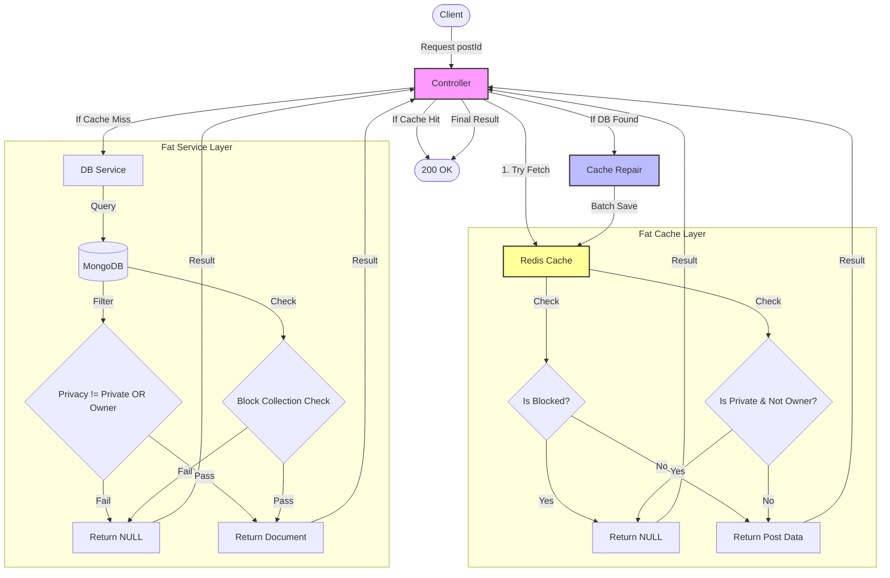
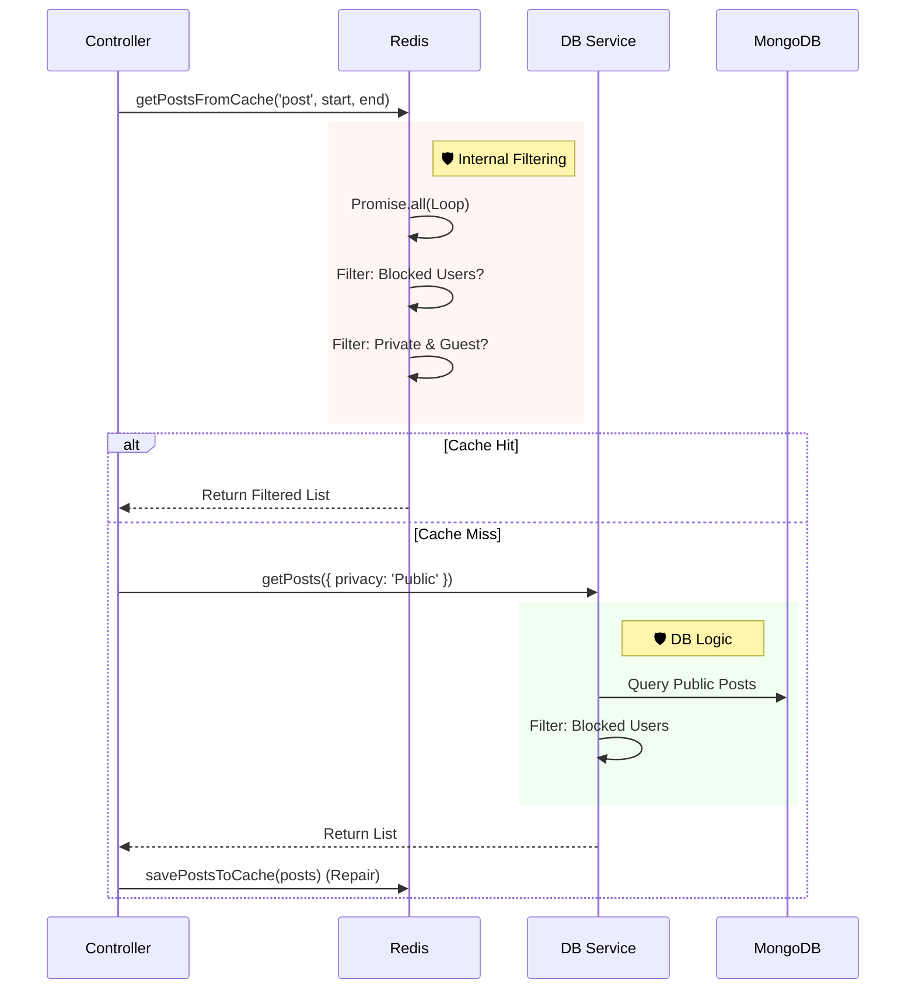

# 📖 Get Posts Feature Architecture

**Module:** Post Service**Pattern:** Write-Through Cache with "Fat Data Layer" & "Skinny Controller".**Description:** Handles fetching posts (Single & Feed) with built-in auto-scaling checks for Privacy and Blocking within the data access layer.

## 🏗️ Core Architecture Concepts

### 1\. "Skinny Controller" Philosophy

The Controller does **NO** logic regarding "Who can see what". It acts purely as a traffic manager:

1.  Ask Cache.
2.  If missing, Ask DB.
3.  If found in DB, **Repair Cache**.
4.  Return Data.

### 2\. "Fat Data Layer" (Security by Default)

Security checks (Blocking & Privacy) are strictly encapsulated inside PostCache and PostService.

- **Result:** If a user is blocked or the post is private, the data layer returns null. The Controller treats it exactly like a "404 Not Found", ensuring no data leaks ever occur.

### 3\. Smart Cache Repair (Batching)

- **Strategy:** Lazy Loading.
- **Optimization:** Uses savePostsToCache (Array) to repair multiple posts in a **single Redis transaction** (Pipeline) without incorrectly incrementing the user's post count.

## 1️⃣ Get Single Post

**Endpoint:** GET /api/v1/post/:postId

### 🔄 Logic Flow

1.  **Cache Fetch:** Call postCache.getPostFromCache(postId, currentUserId).

    - _Internal Check:_ Returns null if blocked or private.

2.  **Cache Miss:** If null, call postService.getOnePost(postId, currentUserId).

    - _Internal Check:_ Database query filters out Private posts (unless Owner) and checks Block collection.

3.  **Repair:** If found in DB, execute postCache.savePostsToCache(\[post\], userId) to fix Redis.
4.  **Response:** Return 200 OK or 404 Not Found.

## 2️⃣ Get User Feed (Pagination)

**Endpoint:** GET /api/v1/post/user/:userId/:page

### 🔄 Logic Flow

1.  **Target:** Fetches from post:{userId} (Sorted Set).
2.  **Cache Fetch:** Call postCache.getUserPostsFromCache.

    - _Internal Loop:_ Iterates IDs, fetches Hashes, and **skips** any Private post if requester != owner.

3.  **Cache Miss:** Call postService.getPosts.

    - _DB Query:_ Explicitly excludes Private posts via MongoDB Query if requester != owner.

4.  **Repair:** Uses savePostsToCache(posts) to batch-save the page to Redis.

```mermaid
sequenceDiagram
    participant Client
    participant Ctrl as Controller
    participant Cache as Redis (Sorted Set)
    participant Service as DB Service
    participant DB as MongoDB

    Client->>Ctrl: GET /user/:id/page

    Note over Ctrl, Cache: 1. Try Cache Fetch
    Ctrl->>Cache: getUserPostsFromCache(key: post:{userId})

    rect rgb(4, 3, 3)
        Note right of Cache: 🛡️ Security Check
        Cache->>Cache: Check "blocked:userId"
        Cache->>Cache: Loop IDs -> HGETALL
        Cache->>Cache: Filter: Skip if (Private & Not Owner)
    end

    Cache-->>Ctrl: Return List OR Empty

    alt Cache Hit
        Ctrl-->>Client: 200 OK (Cached Data)
    else Cache Miss
        Note over Ctrl, Service: 2. DB Fallback
        Ctrl->>Service: getPosts(query)

        rect rgb(7, 9, 7)
            Note right of Service: 🛡️ DB Logic
            Service->>DB: Query { privacy: { $ne: 'Private' } }
            Service->>DB: Check BlockModel
        end

        DB-->>Service: Return Documents
        Service-->>Ctrl: Return Documents

        Note over Ctrl, Cache: 3. Cache Repair
        Ctrl->>Cache: savePostsToCache(posts)
        Cache->>Cache: ZADD & HSET (Batch)

        Ctrl-->>Client: 200 OK (Live Data)
    end
```

📖 Get Posts Architecture & Implementation
==========================================

**Module:** Post Service**Architecture Pattern:** Write-Through Cache with **Lazy Repair** & **Fat Data Layer**.**Core Philosophy:** The Controller acts as a traffic manager. Security (Blocking) and Privacy logic are encapsulated within the Data Access Layer (Cache & Service) to ensure "Security by Default".

🏗️ Core Principles
-------------------

1.  **Skinny Controller:**
    
    *   Does NOT contain business logic for "Who sees what".
        
    *   Flow: Try Cache → If Miss: Try DB → If Found: Repair Cache → Response.
        
2.  **Fat Data Layer (Security Encapsulation):**
    
    *   **Cache:** Internally filters out blocked users and private posts (for guests) inside the fetch loop.
        
    *   **Service:** Internally filters blocked users via post-fetch checks or DB queries.
        
3.  **Smart Cache Repair:**
    
    *   Uses savePostsToCache(posts\[\]) (Batch Strategy) to fix Redis misses without corrupting user post counters.
        
4.  **Hybrid Filtering Strategy:**
    
    *   **Global Feed:** Uses Redis (Primary) + DB Fallback.
        
    *   **Media Filters (Img/Vid):** Bypasses Redis and uses DB directly for accurate pagination.
        

3️⃣ Get Global Feed (All Posts)
Endpoint: GET /post/all/:page

Logic Flow
Source: Redis Sorted Set (post).

Blocking: The Cache Method iterates and skips posts from users who blocked the requester (or vice versa).

DB Fallback: Must use explicit query { privacy: 'Public' } to prevent private posts from leaking, then filters blocked users via Service.

🧠 Feed Logic Visualization

4️⃣ Get Media Feeds (Images/Videos)
-----------------------------------

**Endpoints:** /post/images/:page, /post/videos/:page

### Logic Flow

*   **Strategy:** **Direct DB Access** (Bypass Redis).
    
*   **Reason:** Storing separate lists in Redis is memory-expensive. Filtering in-memory causes pagination gaps ("Holey Pages").
    
*   **Implementation:**
    
    1.  Controller calls Service directly.
        
    2.  Query: { privacy: 'Public', imgId: { $ne: '' } }.
        
    3.  Service filters out Blocked users.
