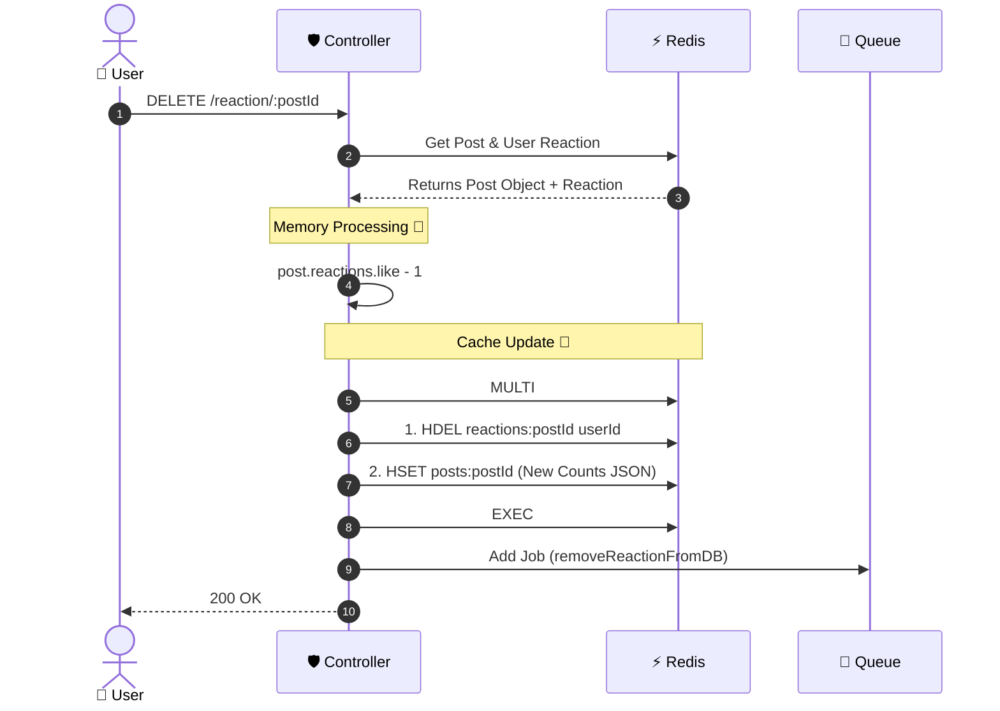

📊 Visual Workflows (Mermaid)
-----------------------------

### 1\. Logic Flow (Controller)

```mermaid
graph TD
    A[Request: REMOVE Reaction] --> B{Get Post & Reaction from Cache/DB}
    
    B -- "Post Not Found" --> C[❌ Throw 404]
    B -- "Reaction Not Found" --> D[✅ Return 200 OK directly]
    
    B -- "Reaction Found" --> E[Proceed to Remove]
    
    E --> F[Cache: Update Object in RAM]
    F --> G[Cache: HSET (Overwrite Counts)]
    F --> H[Cache: HDEL User Reaction]
    
    H --> I[Queue: Add 'removeReactionFromDB' Job]
    I --> J[Response: 200 OK]
```

2\. Sequence Diagram (User's Implementation)


